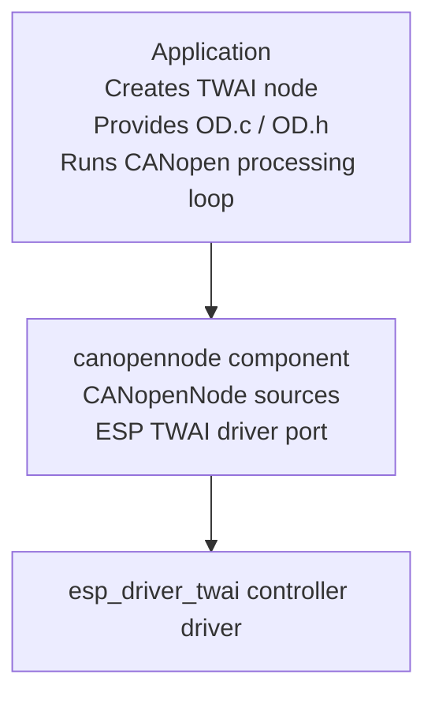

# CANopenNode Programming Guide

`canopennode` ports upstream [CANopenNode](https://github.com/CANopenNode/CANopenNode) to ESP-IDF through the `esp_driver_twai` node API.

Use this component when an ESP-IDF application needs to act as a CANopen node while keeping TWAI controller setup under application control. The port supplies the CANopenNode driver glue; your application supplies the Object Dictionary and the device behavior around it.

## Integration Model

The CANopenNode stack is initialized on top of an existing TWAI node:



This split is intentional. It lets the same CANopen integration work with the on-chip TWAI controller or another TWAI node backend, while board-specific GPIOs, bit timing, queue depth, and transceiver details stay in the application.

## Bring-Up Checklist

1. Generate or write the CANopen Object Dictionary files for the device.
2. Add `OD.c` to the application component sources and make `OD.h` visible where needed.
3. Create and configure a TWAI node with the desired bitrate and pins.
4. Call `CO_new()`, initialize CANopenNode with the TWAI node handle, and enter normal mode.
5. Call `CO_process()` periodically. If PDO is enabled, also call the RPDO and TPDO process functions.
6. Handle `CO_NMT_reset_cmd_t` by re-running the CANopen communication reset sequence.

## Initialization Skeleton

The important detail is that CANopenNode owns the communication reset loop, but the application owns the TWAI node lifetime:

```c
#include "freertos/FreeRTOS.h"
#include "esp_timer.h"
#include "esp_twai.h"
#include "esp_twai_onchip.h"
#include "CANopen.h"
#include "OD.h"

enum {
    CANOPEN_NODE_ID = 1,
    FIRST_HEARTBEAT_TIME_MS = 1000,
    SDO_SERVER_TIMEOUT_MS = 1000,
    SDO_CLIENT_TIMEOUT_MS = 500,
    CANOPEN_TASK_PERIOD_MS = 10,
};

void app_main(void)
{
    twai_node_handle_t node_hdl;
    twai_onchip_node_config_t node_config = {
        .io_cfg.tx = 4,
        .io_cfg.rx = 5,
        .io_cfg.quanta_clk_out = GPIO_NUM_NC,
        .io_cfg.bus_off_indicator = GPIO_NUM_NC,
        .bit_timing.bitrate = 200000,
        .tx_queue_depth = 5,
    };
    ESP_ERROR_CHECK(twai_new_node_onchip(&node_config, &node_hdl));

    CO_t *co = CO_new(NULL, NULL);
    CO_NMT_reset_cmd_t reset = CO_RESET_COMM;

    while (reset != CO_RESET_APP) {
        uint32_t err_info = 0;

        CO_CANmodule_disable(co->CANmodule);
        CO_CANinit(co, node_hdl, node_config.bit_timing.bitrate / 1000);
        CO_CANopenInit(co, NULL, NULL, OD, NULL, 0,
                       FIRST_HEARTBEAT_TIME_MS,
                       SDO_SERVER_TIMEOUT_MS,
                       SDO_CLIENT_TIMEOUT_MS,
                       false, CANOPEN_NODE_ID, &err_info);

#ifdef CONFIG_CO_PDO
        CO_CANopenInitPDO(co, co->em, OD, CANOPEN_NODE_ID, &err_info);
#endif

        CO_CANsetNormalMode(co->CANmodule);

        reset = CO_RESET_NOT;
        int64_t last_us = esp_timer_get_time();
        while (reset == CO_RESET_NOT) {
            int64_t now_us = esp_timer_get_time();
            uint32_t time_diff_us = (uint32_t)(now_us - last_us);

            reset = CO_process(co, false, time_diff_us, NULL);
#ifdef CONFIG_CO_PDO
            CO_process_RPDO(co, false, time_diff_us, NULL);
            CO_process_TPDO(co, false, time_diff_us, NULL);
#endif

            last_us = now_us;
            vTaskDelay(pdMS_TO_TICKS(CANOPEN_TASK_PERIOD_MS));
        }
    }

    CO_delete(co);
    twai_node_delete(node_hdl);
}
```

The complete heartbeat example also demonstrates Object Dictionary extensions, SDO client self-test, and asynchronous PDO handling.

## Object Dictionary Integration

Most applications keep generated Object Dictionary files in their `main` component:

```cmake
idf_component_register(
    SRCS "app_main.c" "OD.c"
    INCLUDE_DIRS "."
)
```

When `CONFIG_CO_MULTIPLE_OD` is disabled, upstream CANopenNode includes `OD.h` directly from the stack sources. In that mode, make the application include directory visible to the `canopennode` component:

```cmake
idf_component_get_property(canopennode_lib canopennode COMPONENT_LIB)
target_include_directories(${canopennode_lib} PRIVATE ${CMAKE_SOURCE_DIR}/main)
```

When `CONFIG_CO_MULTIPLE_OD` is enabled, CANopen parameters are passed through `CO_config_t` at `CO_new()` time.

## Kconfig Options

Configure the stack from `Component config -> CANopenNode Stack Config`.

- Enable the SDO server for normal devices that expose local Object Dictionary entries to a CANopen master or PC tool.
- Enable the SDO client only when this device needs to initiate uploads or downloads to other nodes.
- Enable asynchronous PDO when the application needs event-driven RPDO/TPDO communication. This port does not enable `SYNC`, so synchronous PDO operation is intentionally unavailable.
- Enable multiple Object Dictionary mode when the application needs upstream CANopenNode `CO_config_t` based initialization.

## Processing Loop Notes

`CO_process()` expects elapsed time in microseconds. A simple `esp_timer_get_time()` delta is enough for the heartbeat example, but production applications should choose a task period that matches the timing needs of the configured CANopen objects.

When PDO support is enabled:

- Call `CO_process_RPDO()` before application logic that consumes received PDO data.
- Update mapped application data as needed.
- Call `CO_process_TPDO()` after application logic that may produce transmitted PDO data.

The heartbeat example keeps the loop compact, but applications often wrap this in a dedicated FreeRTOS task.

## Current Port Limits

This port currently targets a practical CiA 301 subset: NMT/heartbeat producer, emergency producer, Object Dictionary access, SDO server, optional SDO client, and optional asynchronous PDO.

`SYNC`, synchronous PDO, `TIME`, and heartbeat consumer are not enabled yet. The target configuration forces unsupported modules off so that upstream CANopenNode code is not accidentally built in an unsupported mode.

## Heartbeat Example

The heartbeat example uses TWAI TX GPIO 4, RX GPIO 5, node ID 1, and 200 kbit/s bitrate.

Build and flash the example like a regular ESP-IDF application:

```bash
idf.py set-target esp32
idf.py build flash monitor
```

To test from a Linux host with SocketCAN:

```bash
sudo ip link set can0 up type can bitrate 200000
pip install canopen
sudo python3 test_canopen.py
```

If your SocketCAN interface is not `can0`, edit the `channel` argument in the test script.
